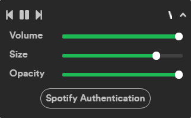
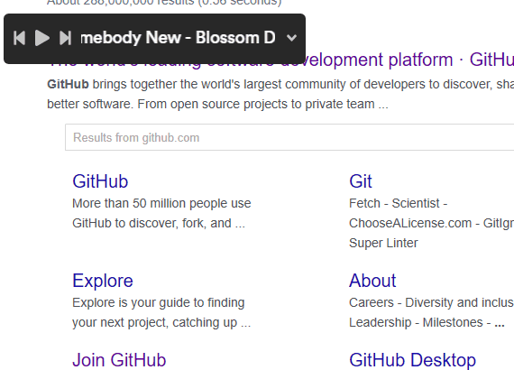
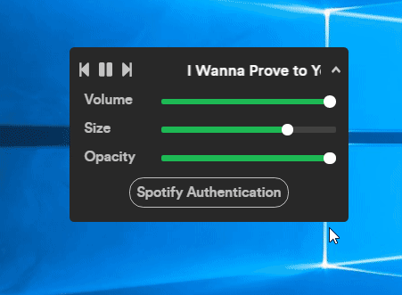

# SpotifyFloats

SpotifyFloats is an always-on-top player for Spotify. It uses [Spotify Web API](https://developer.spotify.com/documentation/web-api/) to allow users to control basic playback functions.

## Motivation
I am a Spotify user that mainly uses Spotify while coding. One problem with Spotify (or any other music player) is that when you want to change volume, skip songs, or know the title of a song, you have to open the application, interact with the application, and go back to what you were doing. This can easily make you lose focus and as a coder I found it  very troublesome. I was looking for a way to deal with the situation and thought a floating player might help. I thought that there would be an always-on-top widget for Spotify already provided by the company, but currently there is none. After doing some research, I found that there is [quite a bit of people like me who wanted one](https://community.spotify.com/t5/Live-Ideas/Desktop-Spotify-floating-Toolbar-Player/idi-p/76167). In order to help myself and others, I decided to build an always-on-top version of Spotify.

## Screnshots

SpotifyFloats stays on top of other windows.

SpotifyFloats is designed to look similar to the original desktop version Spotify application. It allows users to control playback volume, window size and opacity.

## Tech/framework used
* [Electron](https://www.electronjs.org/)
* [Angular](https://angular.io/)
* [JavaScript/TypeScript](https://www.typescriptlang.org/)
* [RxJS](https://rxjs-dev.firebaseapp.com/)
* [SASS/CSS](https://sass-lang.com/)
* [HTML](https://developer.mozilla.org/en-US/docs/Web/HTML)

## Installation
* SpotifyFloats uses Spotify Web API and thus requires api key from Spotify. After obtaining client id and secret from Spotify, place them in `src/app/app.config.ts`.
* Building SpotifyFloats requires `node` and `npm`. Run `npm install` and then `npm run electron-build` to build and run the application. After the initial build is complete, `npm run electron` can be used to start the application.

## License

Seiyoung Ahn 2020
